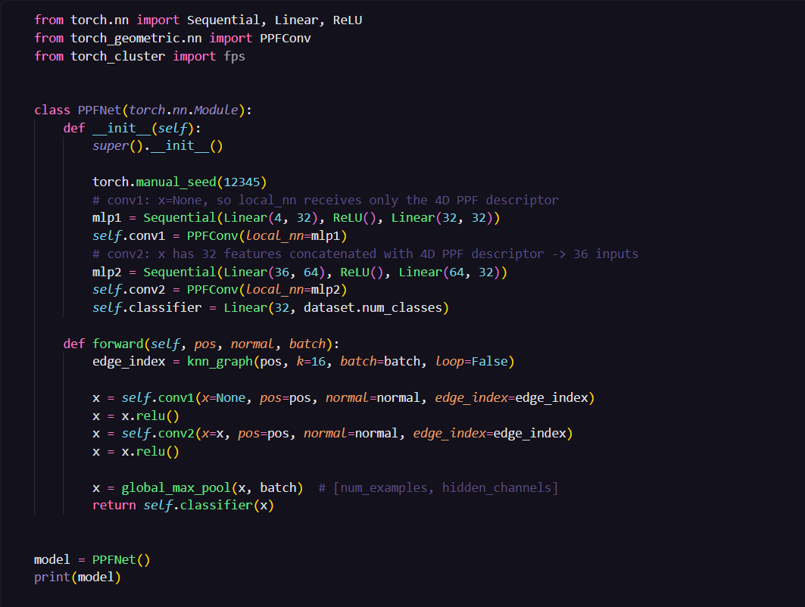
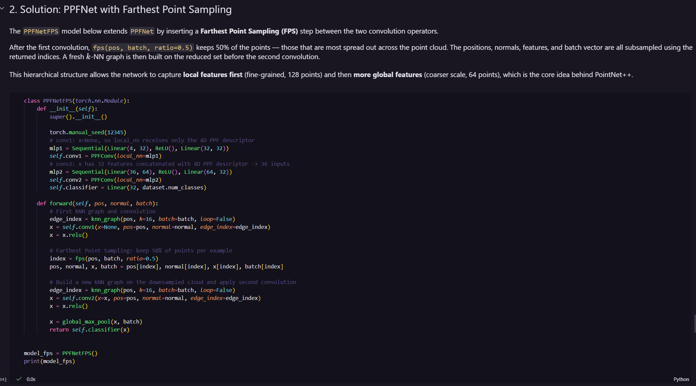

# Emerging Directions in Deep Learning - Lab 4
Student: Pascu Ionut Alexandru, group 507

---

## Overview

The goal is to train a neural network to **recognize 3D shapes** — like "this is a sphere", "this is a cube", "this is a pyramid" — when given only a **cloud of points** sampled from the shape's surface. 

We start from a baseline (PointNet) and improve on that by making the network **rotation-invariant** (PPFNet) and then adding a hierarchical structure (PPFNetFPS). The final model can recognize shapes even when they're randomly rotated in space.

---

## The dataset — GeometricShapes

The dataset has **40 geometric shapes** — circles, squares, triangles, spheres, cubes, pyramids, cylinders, and more. There's only **1 training example per class** (40 total), which makes the task pretty hard. Each shape is stored as a mesh (triangles), but we convert it to a **point cloud** by randomly sampling 128 points from the surface.

A point cloud is a list of $(x, y, z)$ coordinates — no connections, no order, nothing else.

---

## Step 1 — Turning points into a graph

A plain list of points isn't enough to apply a neural network to. So the first thing we do is connect each point to its **k nearest neighbors** in 3D space (k=16), turning the point cloud into a graph. Each point becomes a node, and edges connect nearby points.

Now we can apply a Graph Neural Network that passes information along those edges.

---

## Step 2 — How PointNet++ actually learns

The key operation: each point looks at its neighbors, gathers information from them, and updates its own representation. The formula is:

$$\mathbf{h}_i^{(l+1)} = \max_{j \in \mathcal{N}(i)} \text{MLP}\left(\mathbf{h}_j^{(l)} \,\|\, \left(\mathbf{p}_j - \mathbf{p}_i\right)\right)$$

Breaking it down:
- For each neighbor $j$ of point $i$, take $j$'s current features and concatenate them with the **relative position** ($\mathbf{p}_j - \mathbf{p}_i$ = "where is $j$ relative to $i$?")
- Run that through a small neural network (MLP) to get a message
- **Take the maximum** across all neighbors to produce point $i$'s new representation

By using the max operation, it means the result doesn't depend on the order you process neighbors in (the network is permutation-invariant).

After two of these layers, we have a rich feature vector per point. Then **global max pooling** squashes everything into one vector for the whole shape, which goes into a linear classifier.

**Result: ~75–80% accuracy on 40 classes.**

---

## The problem — rotations

Training on an upright cube and then testing on a tilted cube, the relative positions $(\mathbf{p}_j - \mathbf{p}_i)$ look completely different. The network has never seen those numbers, so the performance is very bad.

**Accuracy under rotation: 12.5%**

---

## Exercise 1 — PPFNet: making it rotation-invariant

The fix is to stop using raw relative positions and instead describe the relationship between two points in a way that **doesn't change when you rotate the shape**.

This is done with the **Point Pair Feature (PPF)** descriptor. It uses the **surface normals** (the tiny arrows perpendicular to the surface at each point) to compute 4 numbers:

$$\text{PPF}(i, j) = \left( \|\mathbf{d}\|,\ \angle(\mathbf{n}_i, \mathbf{d}),\ \angle(\mathbf{n}_j, \mathbf{d}),\ \angle(\mathbf{n}_i, \mathbf{n}_j) \right)$$

- **Distance** between the two points
- **Angle** between point $i$'s normal and the line connecting them
- **Angle** between point $j$'s normal and the line connecting them
- **Angle** between the two normals

If we rotate the whole shape, all vectors rotate equally — so all distances and angles between them stay the same. These 4 numbers are the same regardless of how the shape is oriented.

The MLP now receives these 4 numbers instead of the raw 3D offset, so the network doesn't rely on any specific orientation. It learns to recognize shapes based on their intrinsic geometry, not their position in space.

For the layer dimensions: the first convolution has no prior features, so it receives only the 4-dimensional PPF as input. The second convolution receives the 32-dimensional output of the first layer concatenated with the 4-dimensional PPF, giving 36 inputs total.

**Accuracy under rotation: 52.5%**

---

## Exercise 2 — PPFNetFPS: adding a "zoom out"

PPFNet is already rotation-invariant, but both convolution layers see the exact same 128 points. The second layer can't "zoom out" to see the bigger picture of the shape.

**Farthest Point Sampling (FPS)** fixes this by reducing the point cloud between the two layers. The idea is simple:
1. Pick any point to start
2. Always pick the next point that is **farthest** from all already-picked points
3. Repeat until you have 64 points (half of 128)

This gives you a **sparse, evenly-spread skeleton** of the shape — not random, not clustered, but uniform. Then the second convolution runs on this reduced cloud with a fresh k-NN graph.

Because the 64 points are more spread out, each point's neighborhood now covers a **larger chunk of the shape**. So the first layer learns fine local details, and the second layer learns broader structure. This is the same idea as **pooling in CNNs** — progressively coarser representations.

**Accuracy under rotation: 62.5%**

---

## Results

Starting from 12.5% with PointNet, we improved to 52.5% with PPFNet and then to 62.5% with PPFNetFPS. The key was making the network focus on **intrinsic geometry** rather than specific orientations, and then giving it a way to see the shape at multiple scales.
