# Final Project Report — GCN, GraphSAGE, GAT, and GATv2 on ogbn-arxiv

Student: Pascu Ionut Alexandru, group 507

---

## Overview

This project extends the PyTorch Geometric material from the EDDL laboratories from small citation benchmarks such as Cora to the much larger `ogbn-arxiv` dataset from the Open Graph Benchmark.

The final notebook compares four message-passing architectures for node classification:

- `GCN` as the graph-convolution baseline
- `GraphSAGE` as an aggregation-based inductive-style baseline
- `GAT` as the original graph-attention model
- `GATv2` as the more expressive attention variant

The initial hypothesis was that attention-based neighborhood weighting could improve performance on a large citation graph by learning which neighbors matter most for each node. The final experiments show a different outcome on this setup: the two non-attention baselines were stronger, faster, and more stable than the attention models.

---

## Dataset

The experiments use the local copy of `ogbn-arxiv` stored in `Proiect_Final/data`.

Final runtime statistics from the executed notebook:

- Number of nodes: 169,343
- Number of edges after preprocessing: 2,315,598
- Number of node features: 128
- Number of classes: 40
- Train nodes: 90,941
- Validation nodes: 29,799
- Test nodes: 48,603

Preprocessing choices used in the final run:

- `ToUndirected()` enabled
- feature normalization disabled

Disabling `NormalizeFeatures()` was an important practical decision during debugging. On this dataset the input features are already dense semantic embeddings, and row-wise normalization pushed the attention models toward degenerate behavior.

---

## Experimental Setup

### Models

The final executed configurations were:

| Model | Hidden size | Layers | Heads | Dropout | Learning rate | Weight decay | Epochs | Eval cadence |
|---|---:|---:|---:|---:|---:|---:|---:|---:|
| GCN | 128 | 2 | - | 0.5 | 0.01 | 5e-4 | 200 | every epoch |
| GraphSAGE | 128 | 2 | - | 0.5 | 0.01 | 5e-4 | 200 | every epoch |
| GAT | 32 | 2 | 4 | 0.5 | 0.005 | 5e-4 | 200 | every 10 epochs |
| GATv2 | 32 | 2 | 4 | 0.4 | 0.003 | 5e-4 | 200 | every 10 epochs |

### Training protocol

Although the notebook contains utilities for neighbor-sampled training, the final executed experiment used `training_mode='full_batch'` for all four models. That means the comparison below is a direct full-graph comparison under one shared evaluation pipeline.

For each run, the notebook recorded:

- training loss
- train, validation, and test accuracy
- best validation epoch
- test accuracy at the best validation checkpoint
- wall-clock training time
- parameter count
- saved model checkpoint, history JSON, and test predictions

---

## Quantitative Results

### Final summary table

| Model | Best validation accuracy | Test accuracy | Parameters | Training time (s) | Epochs to 60% val acc | Best epoch |
|---|---:|---:|---:|---:|---:|---:|
| GCN | 0.6769 | 0.6689 | 21,672 | 10.84 | 41 | 198 |
| GraphSAGE | 0.6790 | 0.6746 | 43,176 | 9.15 | 37 | 195 |
| GAT | 0.6564 | 0.6542 | 22,008 | 11.71 | 50 | 200 |
| GATv2 | 0.6550 | 0.6484 | 43,680 | 21.72 | 80 | 200 |

### Main findings

1. `GraphSAGE` was the best overall model in the final run.
	It achieved the highest validation accuracy, the highest test accuracy, and the shortest training time.

2. `GCN` was a very strong second baseline.
	Its accuracy was close to `GraphSAGE`, with fewer parameters and only a small slowdown.

3. The attention models underperformed on this setup.
	Both `GAT` and `GATv2` plateaued around $0.65$ test accuracy, below both non-attention baselines.

4. `GATv2` was the most expensive model.
	It used roughly the same parameter budget as `GraphSAGE`, but needed more than twice the wall-clock time.

5. Attention did not provide a better accuracy/compute tradeoff here.
	On this dataset and these hyperparameters, learned attention was not enough to offset the higher optimization difficulty and cost.

---

## Convergence Analysis

The convergence plot shows that `GraphSAGE` and `GCN` reach their best region earlier and stay there consistently. The attention models improve more slowly and never catch up.

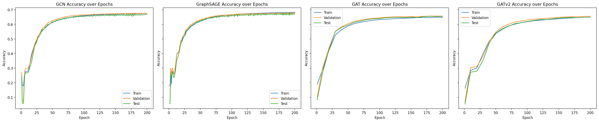

The loss curves confirm the same ranking. `GraphSAGE` achieves the lowest final loss, followed closely by `GCN`. `GAT` and especially `GATv2` converge more slowly and finish with noticeably higher loss values.

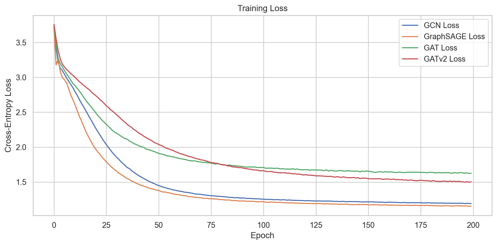

### Interpretation

- `GraphSAGE` combines fast optimization with strong final accuracy.
- `GCN` remains competitive despite its simpler aggregation rule.
- `GAT` learns useful representations, but not enough to beat the baselines.
- `GATv2` is expressive, but in this configuration its additional flexibility did not translate into better classification quality.

---

## Error Analysis

### Confusion matrices

The confusion matrices show that all four models capture the same broad label structure. The main differences are incremental rather than structural.

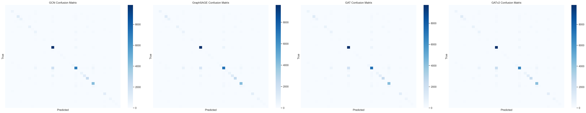

The large diagonal blocks indicate that the dataset is learnable with message passing, but there are still several class pairs with persistent confusion across all models.

### Per-class accuracy

The per-class chart shows that no model dominates every class. Performance gains are class-specific.

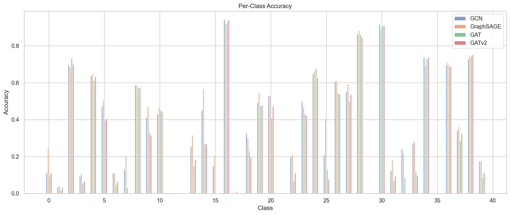

Important observations:

- `GraphSAGE` and `GCN` are the most consistent across classes.
- The attention models occasionally match or exceed the baselines on individual classes, but their gains are not systematic.
- Several classes remain difficult for all models, which suggests that the bottleneck is not only the aggregation operator but also feature overlap and label ambiguity.

### Degree-sensitive behavior

The notebook also generated degree-versus-correctness plots for all four models. The broad trend is similar across architectures: accuracy is reasonably strong for low- and medium-degree nodes, while the very high-degree tail becomes noisy because there are far fewer examples there.

Additional exported figures:

- `report_assets/gcn_degree_accuracy.png`
- `report_assets/sage_degree_accuracy.png`
- `report_assets/gat_degree_accuracy.png`
- `report_assets/gatv2_degree_accuracy.png`

---

## Representation Analysis

One of the clearest qualitative results is that all models produce substantially more structured embeddings than the raw input features.

### GCN embeddings

`GCN` transforms the diffuse raw feature cloud into clearer macro-clusters, especially for the large dominant classes.

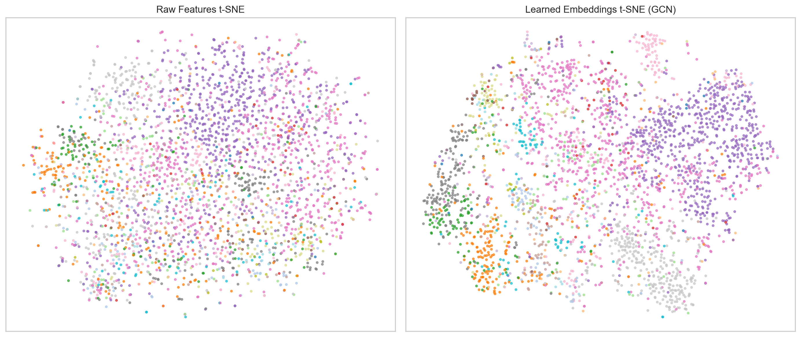

### GraphSAGE embeddings

`GraphSAGE` produces one of the cleanest large-scale layouts among the four models. The right-hand side cluster structure is especially well separated.

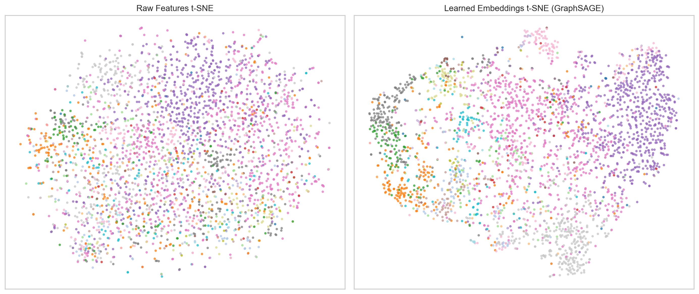

### GAT embeddings

`GAT` also improves separability relative to raw features, but the layout remains less decisive than the best non-attention baseline.

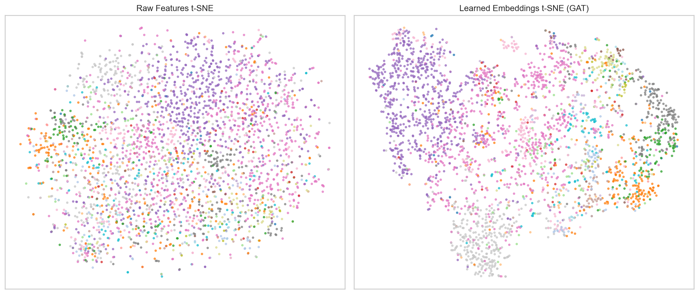

### GATv2 embeddings

`GATv2` produces visually strong large-scale structure and clear class islands in the sampled t-SNE plot. This is a useful reminder that a representation can look qualitatively strong while still not delivering the best downstream accuracy.

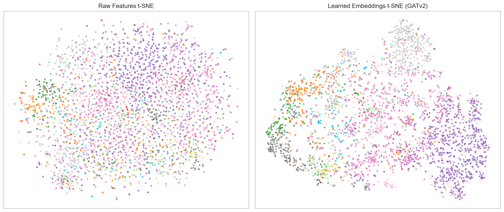

### Representation takeaway

All four architectures improve the geometry of the raw features. However, the best-looking t-SNE is not automatically the best classifier. In the final metrics, `GraphSAGE` still achieved the strongest validation and test accuracy.

---

## Attention Analysis

The attention-specific diagnostics help explain what the attention models are doing internally.

### Attention-weight distributions

For both `GAT` and `GATv2`, most attention coefficients are concentrated very close to zero, with a long right tail of a few much larger values.

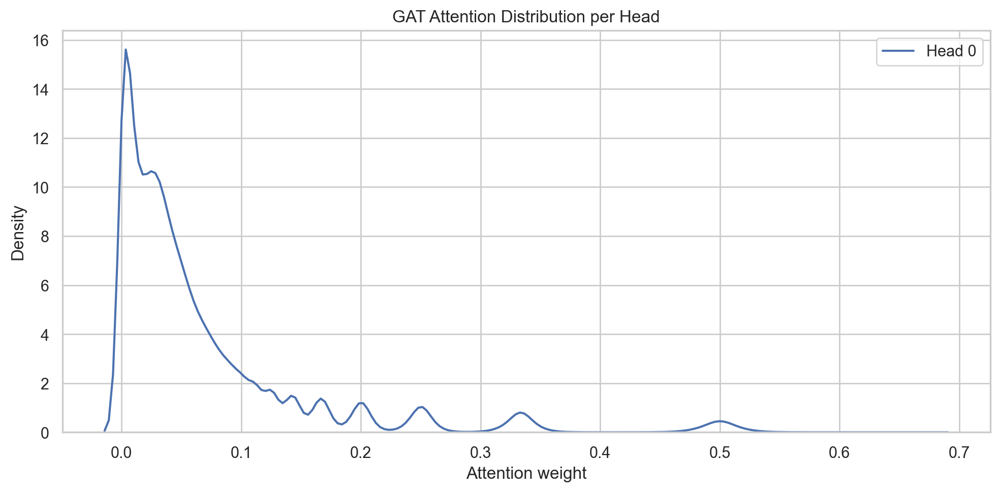

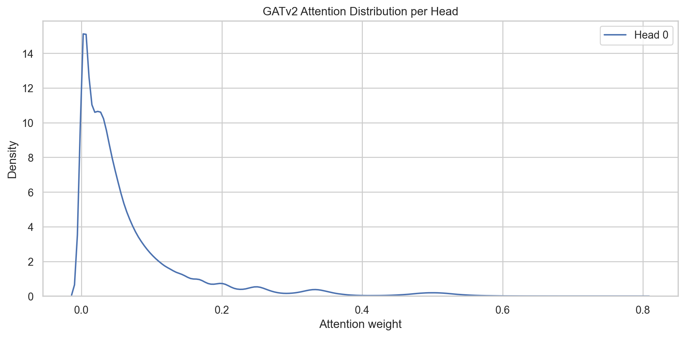

This means the effective aggregation is sparse: many neighbors receive very little weight, while a small subset dominates the message passed to a node.

`GATv2` shows a slightly broader tail than `GAT`, which suggests somewhat more diffuse or flexible weighting in the final layer.

### 1-hop attention subgraphs

The ego-subgraph visualizations around the same test node show that both attention models concentrate strongly on a few edges rather than spreading weight uniformly.

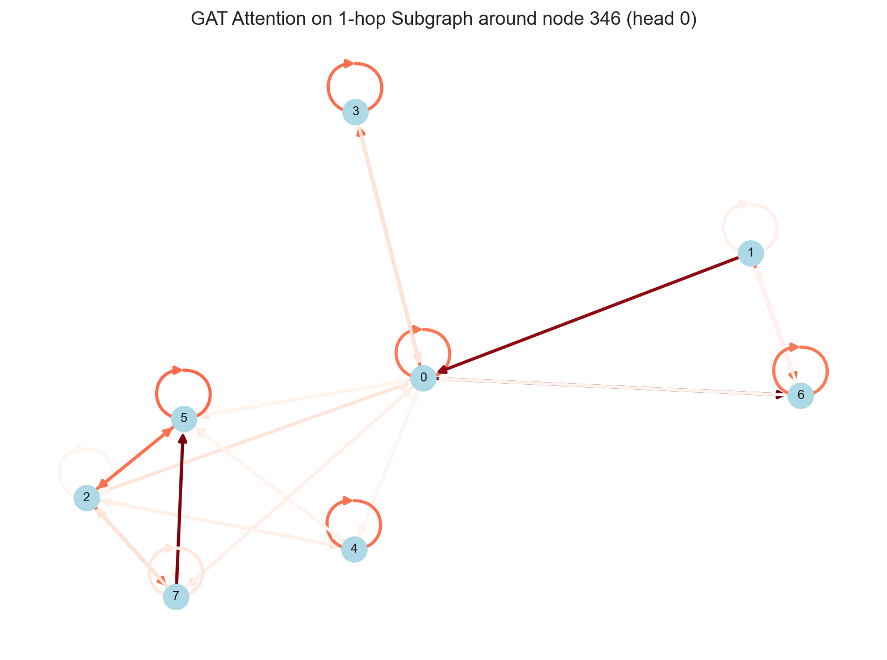

These plots are useful qualitatively, but they also show an important limitation: interpretable local attention patterns do not guarantee better final test accuracy.

---

## Discussion

The final results answer the original project question clearly.

### Did attention help on ogbn-arxiv?

Not in this configuration.

Both attention models learned meaningful representations and non-trivial edge weighting patterns, but they did not outperform the simpler baselines. The strongest model was `GraphSAGE`, followed closely by `GCN`.

### Why did the non-attention baselines win?

The most plausible explanation is that, on this dataset and at this parameter budget:

- the semantic node features are already strong
- simple neighborhood aggregation is sufficient to exploit the graph structure
- attention introduces extra optimization difficulty and runtime cost
- the extra flexibility does not compensate for that cost under the chosen setup

### Why is this still a useful result?

Because negative results are informative when they are cleanly measured.

This project shows that moving from `GCN` to attention is not automatically beneficial, even on a large citation graph where attention seems intuitively attractive. The right comparison is not only expressiveness, but also optimization behavior, time cost, and final accuracy.

---

## Practical Lessons From The Project

1. Stable baselines matter.
	`GCN` and `GraphSAGE` gave a strong reference point and prevented over-interpreting attention-specific plots.

2. Dataset preprocessing matters.
	Disabling feature normalization was important for avoiding collapsed attention behavior.

3. Accuracy and representation quality are related but not identical.
	The t-SNE visualizations show stronger structure after training, but the visually most separated embeddings were not necessarily tied to the best test score.

4. Compute efficiency is part of model quality.
	`GraphSAGE` was not only the most accurate model, but also the fastest one in the final run.

5. Attention is interpretable, but not automatically superior.
	The attention histograms and subgraphs are insightful, yet interpretability alone did not yield better benchmark performance.

---

## Limitations

- The final comparison used one main hyperparameter setting per model, not an extensive tuning sweep.
- The final executed runs were full-batch runs for all four models.
- `GAT` and `GATv2` were evaluated every 10 epochs rather than every epoch, so their curves are sparser.
- t-SNE is only a sampled qualitative view, not a quantitative proof of separability.
- The high-degree tail in the degree plots is noisy because the number of such nodes is small.

---

## Conclusion

The final project successfully implemented and analyzed `GCN`, `GraphSAGE`, `GAT`, and `GATv2` on `ogbn-arxiv` using PyTorch Geometric.

The main empirical conclusion is:

> On this dataset and in the final executed configuration, attention-based models were more expensive but not more accurate than the simpler non-attention baselines.

`GraphSAGE` delivered the best overall result with:

- the highest validation accuracy: $0.6790$
- the highest test accuracy: $0.6746$
- the fastest training time: $9.15$ seconds

`GCN` remained a very strong baseline, while `GAT` and `GATv2` provided useful interpretability and representation analysis but did not improve the benchmark scores.

That is a solid and credible project outcome: the implementation works end-to-end, the visual analysis is rich, and the conclusions are supported by both quantitative results and model-specific diagnostics.

---

## Generated Assets

The report figures exported from the executed notebook are stored in `Proiect_Final/report_assets`.

Main assets used in this report:

- `training_accuracy.png`
- `training_loss.png`
- `confusion_matrices.png`
- `per_class_accuracy.png`
- `gcn_tsne.png`
- `sage_tsne.png`
- `gat_tsne.png`
- `gatv2_tsne.png`
- `gat_attention_distribution.png`
- `gat_attention_subgraph.png`
- `gatv2_attention_distribution.png`
- `gatv2_attention_subgraph.png`

Supplementary assets:

- `gcn_degree_accuracy.png`
- `sage_degree_accuracy.png`
- `gat_degree_accuracy.png`
- `gatv2_degree_accuracy.png`
- `summary_table.csv`
